<p align="center">
  
</p>
<h1 align="center">Factory OS</h1>
<p align="center">One screen for the factory floor. A live plant plan, a zoom into any bay, the subsystem behind every alert, and the numbers that say where to look next.</p>

<p align="center">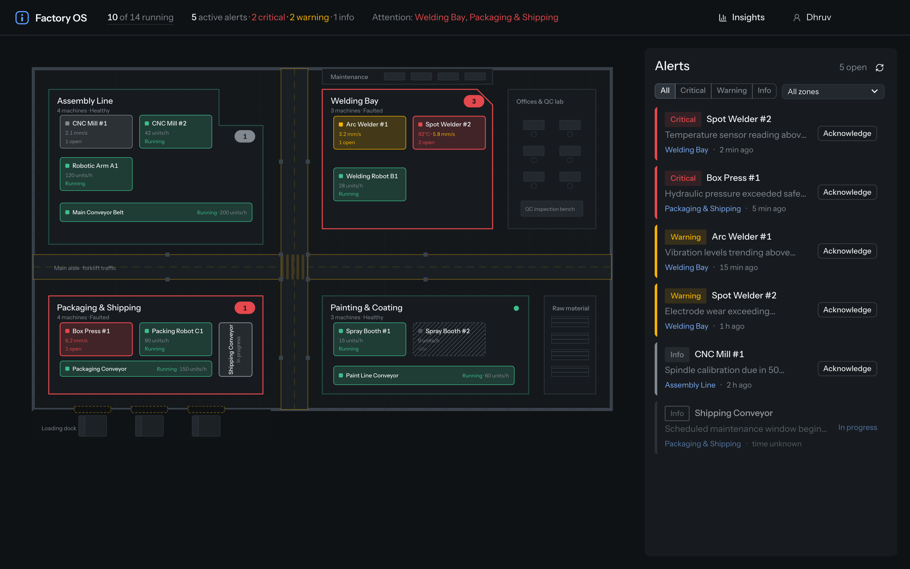</p>

```bash
npm install
npm run dev        # http://localhost:5173
```

The mock API and telemetry feed start with the dev server. Nothing else to configure.

---

## The floor at a glance

The header is the overview. Every number on it is a control: click a severity count to filter the alerts rail, click a zone under *Attention* to zoom to it, hover the running count for the machines that are not.

<p align="center">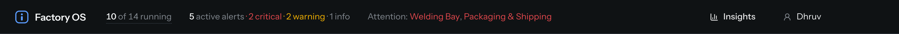</p>

<table>
<tr>
<td width="55%">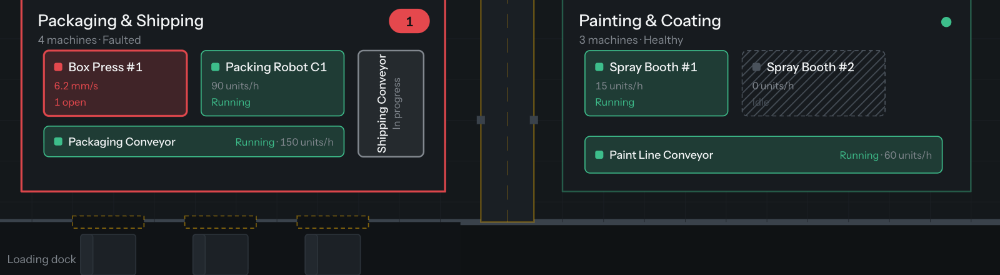</td>
<td>

**Reading a bay**

- **Outline** is the bay's health, derived live from its machines and open alerts.
- **Badge** counts active alerts in the colour of the worst one. Hover it for the split by severity.
- **Solid cell** takes the colour of the machine's most severe alert.
- **Hollow cell** means every alert on it is in progress, someone owns it.
- **Hatched cell** is idle or in maintenance.
- **Readouts** are the subsystems that are alerting, most severe first, ticking live. Healthy machines show throughput.

</td>
</tr>
<tr>
<td>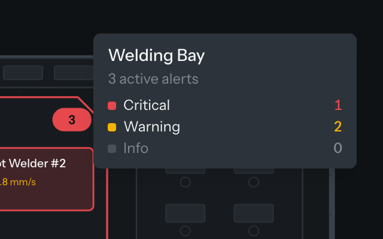</td>
<td>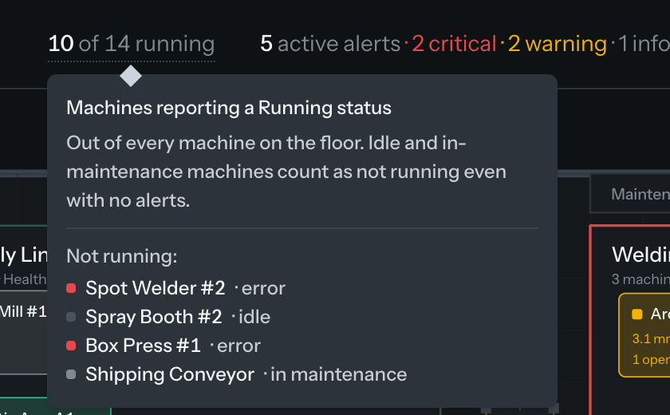</td>
</tr>
</table>

The plan itself is a plant, not a grid: aisles with forklift lanes, structural columns, offices with a QC bench, raw material racks, a maintenance strip and a loading dock. Bays are irregular polygons with named machine slots.

## Alerts rail

<p align="center">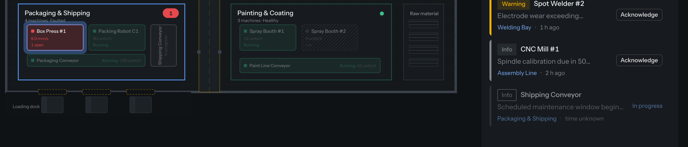</p>

- Sorted open first, then severity, then newest. Filter by severity or bay; the bay filter follows you when you zoom in.
- **Hover a row** and its machine lights up on the plan or in the bay, with everything else dimmed.
- **Click the bay name** on a row to zoom straight to that machine's subsystem.
- **Acknowledge means take ownership**, never clear. It is a two-step confirm, records who took it and when, and the alert stays visible as *In progress · name* in the rail, on the machine and in the hover.

<p align="center">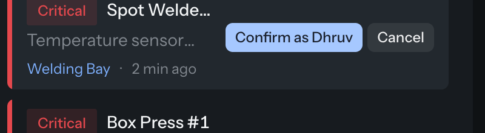</p>

## Zoom into a bay

Clicking a bay is a camera move on the plan, then the isometric scene fades in place. Back pulls the camera out.

<p align="center">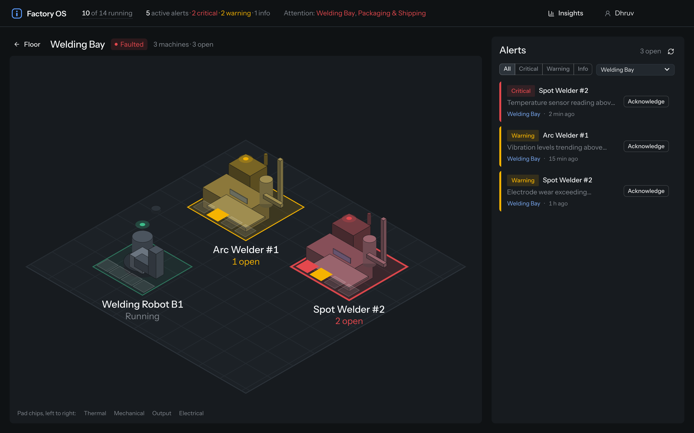</p>

<table>
<tr>
<td width="50%">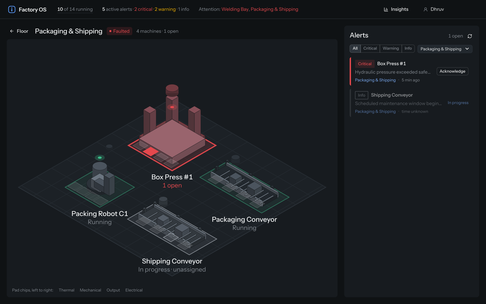</td>
<td width="50%">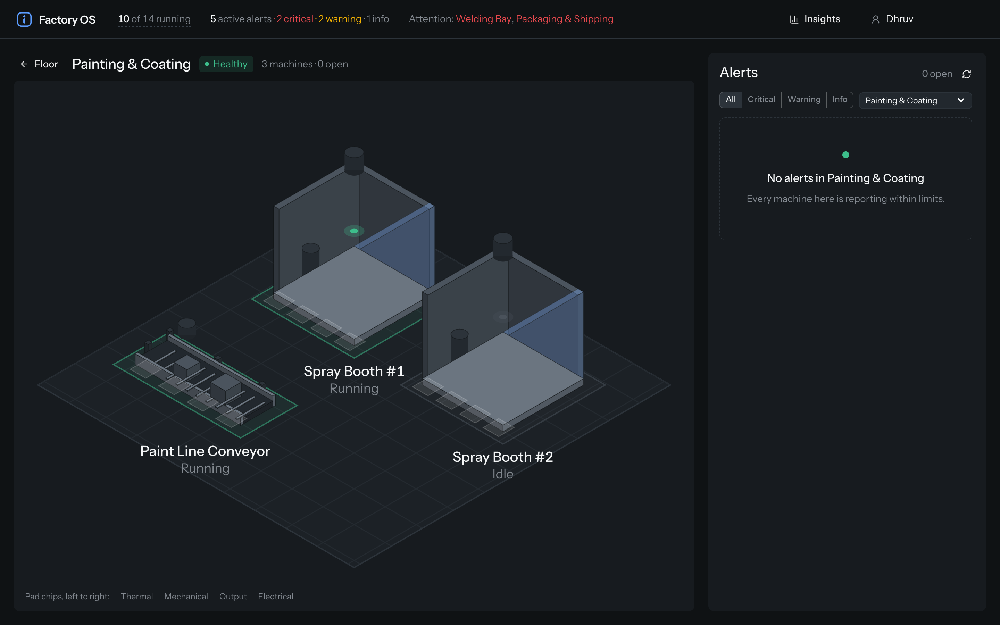</td>
</tr>
</table>

- **Machines are modelled**, not iconed: a CNC mill with an enclosure window and pendant, a press with four columns and a ram, a conveyor with legs, rollers and rails, a welder with a torch boom and gas bottle, a spray booth with a glazed wall and exhaust stack.
- **The pad** under each machine carries its state; **the four chips** on its front edge are its subsystems (thermal, mechanical, output, electrical). A lit chip is where the alert is. Click a chip to open it.
- Hover a machine for its readings and open alerts; duplicate alerts collapse into one line with a count.

## Down to the subsystem

<p align="center">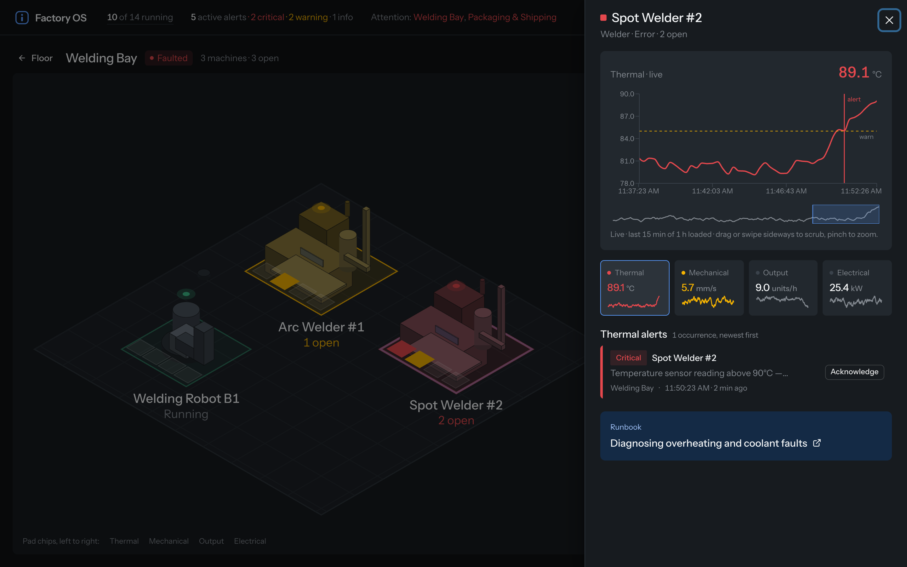</p>

<table>
<tr>
<td width="50%">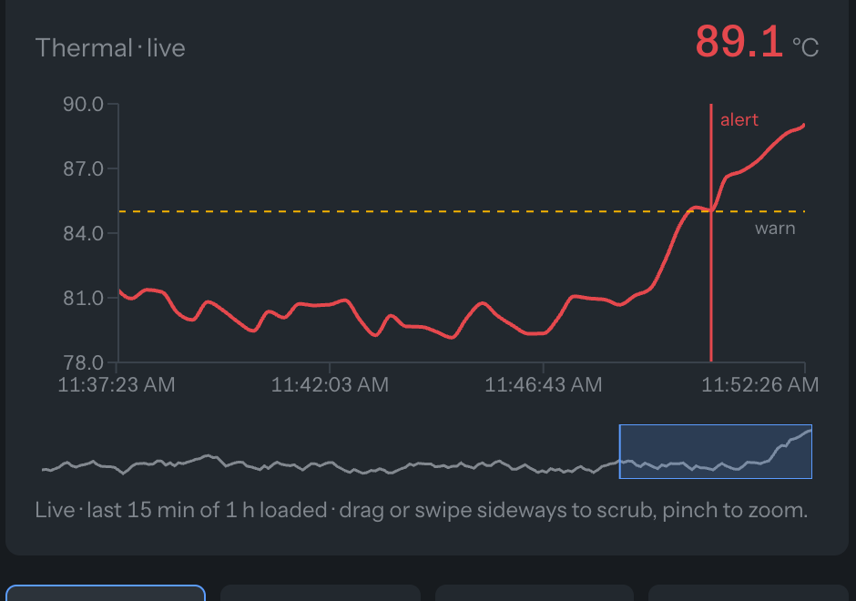</td>
<td>

- **Live chart** of the selected subsystem. Dashed line is the warn threshold; vertical lines mark when each alert was raised, dashed once it is in progress.
- **Scrub** with a two-finger sideways swipe or a drag, pinch to zoom, or drag the strip underneath. Reaching the start loads six hours. *Live* snaps back to the newest data.
- **Four tiles** show every subsystem's value and sparkline, coloured by its fault. Click one to switch the chart.
- Every occurrence of an alert on that subsystem, with its clock time, and a runbook link for the subsystem.

</td>
</tr>
</table>

<p align="center">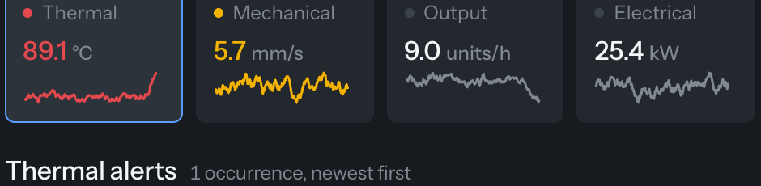</p>

## Insights

The *Insights* button slides a KPI band up under the plan; the plan scales to fit above it so the live view never leaves. Expand it to full screen when you want the numbers alone, Esc to return. Inside a bay, the band scopes to that bay.

<table>
<tr>
<td width="50%">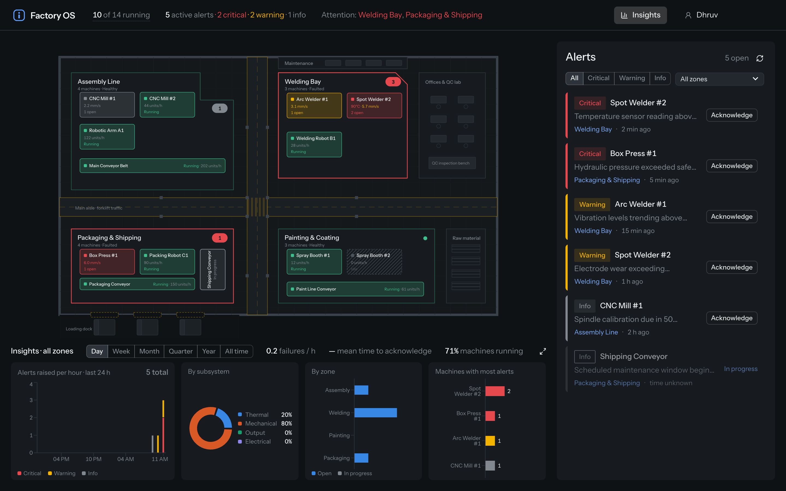</td>
<td width="50%">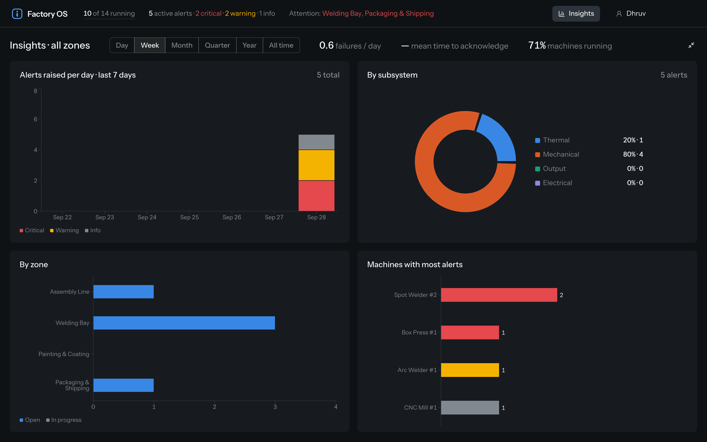</td>
</tr>
</table>

- Failures per hour, day, week or month to match the range; mean time to acknowledge; machines running.
- Alerts over time stacked by severity, re-bucketed per range: day, week, month, quarter, year, all time.
- Share by subsystem, open versus in progress by bay, and the machines with the most alerts.

## When the link drops

If the factory link goes down or the feed goes quiet for 30 seconds, every machine gets a no-link badge and the same icon appears in the header. Hover it for the reason. Nothing else changes, and nothing pretends.

<p align="center">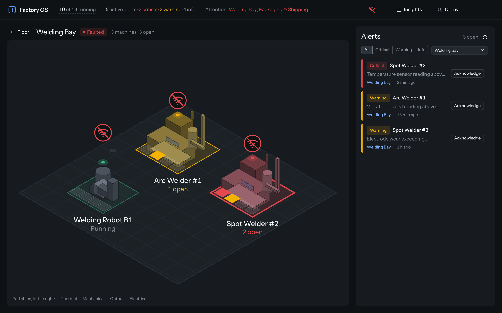</p>

## Colours and icons

| Mark | Meaning |
|---|---|
| 🟥 Red | Critical alert, or a machine in an error state |
| 🟨 Amber | Warning |
| ⬜ Gray | Info alert, or an idle / maintenance machine (hatched) |
| 🟩 Green | Healthy, running |
| 🟦 Blue | Interaction only: selection, highlight, links. Never an alert state |
| Hollow outline | Every alert on the machine is in progress |
| 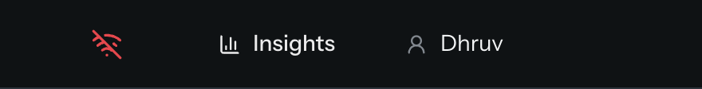 | No-link icon: factory link down or feed quiet. Same badge floats over each machine |
| Bar-chart icon | Insights band toggle |
| Person icon | Operator name; alerts you acknowledge are assigned to it |
| Refresh icon | Re-fetch the alerts list |
| Expand / collapse icons | Insights full screen and back (Esc also works) |

## Try it

In the browser console:

```js
window.__setAlertScenario("stress")   // 50 alerts; "empty" for none; "default" to restore. Then press refresh in the rail.
window.__setFactoryConnected(false)   // drop the link; badges appear within 5 s. true restores it.
```

---

## Notes for reviewers

- **Zone health is derived on the client** from machine status plus open alerts, because the mock's zone health is static and never reflects the feed.
- **Subsystems are the four telemetry channels.** The data has no subsystem concept, so each alert is classified by keyword into thermal, mechanical, output or electrical. It is a labelled presentation heuristic.
- **Ownership lives per browser.** The mock acknowledge endpoint takes no body, so who acknowledged what is kept locally. A real system stores and broadcasts it.
- **The floor plan and machine models are authored data** (`src/lib/floorPlan.ts`, `src/lib/machineModels.ts`), since the API carries no coordinates. Swapping in a real plant is a data change.
- **The simulation was extended and says so.** Every machine now streams every 3 s, a history endpoint returns the last hour shaped around the alert time, and fixture timestamps are rebased to the session so relative times and chart axes agree. The deliberate 1969 record is left alone and shows "time unknown".
- **Starter data issues** (a `machine_name` key, a 1969 timestamp, a wrong zone name, socket alerts carrying the zone id as the name, a wrong machine count, a stale-closure socket hook, no machines hook) are each absorbed in one place: `src/lib/normalize.ts`, `src/hooks/useFactoryWebSocket.ts`, `src/hooks/useMachines.ts`.
- **Known gaps:** no automated tests yet (the logic is in pure functions written to be tested first); alerts only disappear when the backend clears them, which the mock never does; phones get a scrolling stack rather than a designed layout.

<details>
<summary><b>Starter documentation</b> (tech stack, hooks, endpoints, data types)</summary>


A React + TypeScript starter project for a factory floor monitoring UI. The app simulates a factory with multiple **zones**, each containing **machines** that report telemetry data and raise **alerts**.

All backend data is mocked via [MSW](https://mswjs.io/) (Mock Service Worker) — no real server required.

---

## Quick Start

All dependencies are pre-installed. Just run:

```bash
npm run dev
```

Open [http://localhost:5173](http://localhost:5173) in your browser. The mock API is already running — you should see a navigation bar with Dashboard, Alerts, and Topology links.

> If you need to reinstall dependencies for any reason: `npm install`

---

## Tech Stack

| Tool | Version | Purpose |
|---|---|---|
| React | 18 | UI framework |
| TypeScript | 5 | Type safety |
| Vite | 6 | Dev server and build |
| Chakra UI | 2 | Component library ([docs](https://v2.chakra-ui.com/docs/components)) |
| React Query | 5 | Server state management |
| React Router | 6 | Client-side routing |
| MSW | 2 | API mocking |

---

## Project Structure

```
src/
├── types.ts                  # All TypeScript interfaces
├── App.tsx                   # Root component (providers, router, navbar)
├── main.tsx                  # Entry point (MSW initialization)
├── hooks/
│   ├── useFactoryStatus.ts   # Factory connection status + stats
│   ├── useZones.ts           # Zone list with health
│   ├── useAlerts.ts          # Alerts with optional filtering
│   ├── useAcknowledgeAlert.ts # Mutation to acknowledge an alert
│   └── useFactoryWebSocket.ts # Real-time event subscription
├── components/
│   └── SampleCard.tsx        # Example Chakra UI card (for reference)
├── pages/
│   ├── Dashboard.tsx         # Main dashboard page
│   ├── Alerts.tsx            # Alerts / active problems page
│   └── Topology.tsx          # Factory topology page
└── mocks/
    ├── browser.ts            # MSW browser setup
    ├── handlers.ts           # REST API mock handlers
    ├── websocket.ts          # WebSocket emulator
    └── data/
        ├── zones.json        # 4 factory zones
        ├── machines.json     # 14 machines across zones
        ├── alerts.json       # Active alerts
        └── events.json       # Event log
```

---

## Data Hooks

Pre-built hooks that handle all data fetching via React Query. Import from `src/hooks/`.

### `useFactoryStatus()`

Returns overall factory connection info.

```ts
const { data, isLoading, isError } = useFactoryStatus();
// data: FactoryStatus | undefined
```

### `useZones()`

Returns the list of factory zones.

```ts
const { data, isLoading, isError } = useZones();
// data: Zone[] | undefined
```

### `useAlerts(filters?)`

Returns active alerts. Accepts optional filters.

```ts
const { data, isLoading, isError } = useAlerts();
const { data } = useAlerts({ severity: "critical" });
const { data } = useAlerts({ zone: "welding" });
```

### `useAcknowledgeAlert()`

Mutation hook. Marks an alert as acknowledged.

```ts
const { mutate } = useAcknowledgeAlert();
mutate("alert-id-here");
```

### `useFactoryWebSocket(callback)`

Subscribes to real-time events. Manages connection lifecycle.

```ts
useFactoryWebSocket((message) => {
  // message.type: "telemetry" | "alert" | "event"
  // message.payload: varies by type
});
```

---

## REST API Endpoints

All endpoints are mocked and available immediately when the dev server runs.

| Endpoint | Method | Returns |
|---|---|---|
| `/api/factory/status` | GET | `FactoryStatus` object |
| `/api/zones` | GET | `Zone[]` |
| `/api/zones/:zoneId/machines` | GET | `Machine[]` for that zone |
| `/api/machines/:machineId` | GET | Single `Machine` |
| `/api/alerts` | GET | `Alert[]` — supports `?severity=` and `?zone=` query params |
| `/api/events` | GET | `FactoryEvent[]` |
| `/api/alerts/:alertId/acknowledge` | POST | `{ success: true }` |

---

## Data Types

All TypeScript interfaces are defined in `src/types.ts`:

```ts
interface FactoryStatus {
  connected: boolean;
  totalMachines: number;
  zoneCount: number;
  uptimeHours: number;
  lastUpdated: string;
}

interface Zone {
  id: string;
  name: string;
  machineCount: number;
  health: "healthy" | "degraded" | "faulted";
}

interface Machine {
  id: string;
  name: string;
  type: "cnc_mill" | "robotic_arm" | "conveyor" | "press" | "welder" | "spray_booth";
  zoneId: string;
  status: "running" | "idle" | "error" | "maintenance";
  telemetry: MachineTelemetry;
  lastUpdated: string;
}

interface MachineTelemetry {
  temperature: number;
  vibration: number;
  throughput: number;
  powerDraw: number;
}

interface Alert {
  id: string;
  machineId: string;
  machineName: string;
  zoneId: string;
  zoneName: string;
  severity: "critical" | "warning" | "info";
  message: string;
  timestamp: string;
  acknowledged: boolean;
}

interface FactoryEvent {
  id: string;
  machineId: string;
  machineName: string;
  type: "machine_started" | "machine_stopped" | "alert_raised" | "alert_cleared" | "maintenance_scheduled";
  message: string;
  timestamp: string;
}

interface WebSocketMessage {
  type: "telemetry" | "alert" | "event";
  payload: unknown;
}
```

---

## Mock Data Summary

| Dataset | Records | Notes |
|---|---|---|
| Zones | 4 | Assembly, Welding, Painting, Packaging |
| Machines | 14 | Spread across all zones |
| Alerts | 6 | Mix of critical, warning, info; some acknowledged |
| Events | 20 | Machine starts/stops, alerts raised, maintenance |

### WebSocket Events

The WebSocket emulator pushes:
- **Telemetry updates** every ~3 seconds (random machine)
- **New alerts** every ~15 seconds (30% chance each interval)

---

## Reference Component

`src/components/SampleCard.tsx` demonstrates common Chakra UI patterns:
- Card with header, body, badge
- Loading skeleton state
- Props interface with TypeScript

</details>
